## Sample Flask application using [Flask-RESTPlus](https://flask-restplus.readthedocs.io/en/stable/index.html) , [Flask-Marshmallow](https://flask-marshmallow.readthedocs.io/en/latest/) and [Flask-SQLAlchemy](https://flask-sqlalchemy.palletsprojects.com/en/2.x/quickstart/)

## Setting up the VirtualEnv and install dependencies

Go inside the project folder and execute the below commands. We will use [Pipenv](https://pypi.org/project/pipenv/) to setup the VirtualEnv.

```
pipenv shell
pipenv install

```

Dependencies will be installed from the Pipfile. Python version 3.7 is used for this project.

## Run the Application

```
python app.py

```

This will start the application on port 5000

## Test the application

Swagger-UI can be used to test the application.


The server will start at <http://localhost:5000>.

---

# DevOps Final Project

Student Name: Sara Tuvian  
ID: 207601279

GitHub Repository:
https://github.com/saratuvian/final-python

---

## Project Description

This project is a Flask REST API application built using:

- Flask-RESTPlus
- Flask-Marshmallow
- Flask-SQLAlchemy

The project was containerized using Docker, automated with GitHub Actions CI/CD, and deployed to AWS ECS.

---

# Part A – Docker (25 Points)

The application was containerized using a custom Dockerfile.
The container runs the Flask REST API successfully.

## GitHub Repository

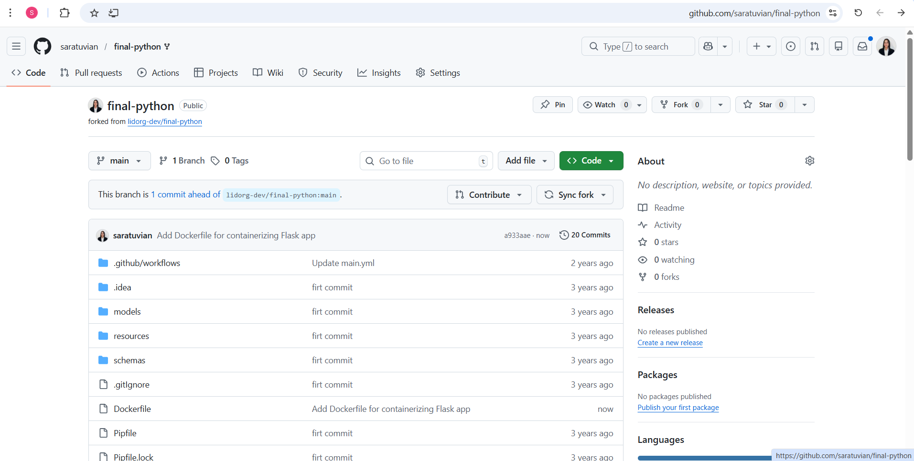

## Dockerfile

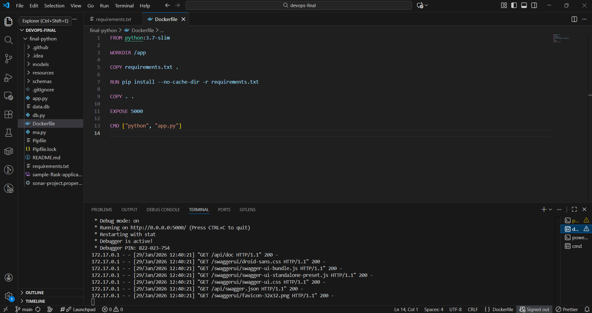

The Dockerfile builds a Python 3.7 slim image, installs dependencies from requirements.txt, and runs the Flask application.

## Application Running in Docker

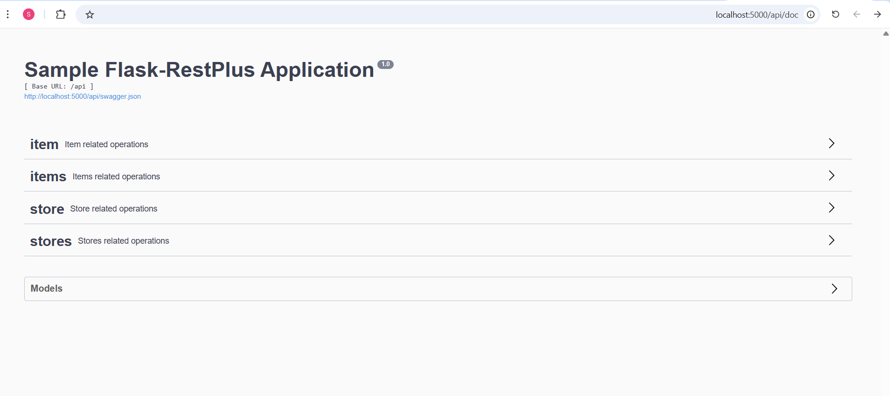

The container was built and executed successfully using Docker commands.
The application is accessible and returns a valid response in the browser.

---

## Additional Docker Verification (Part A Extended)

### Docker Image Built Successfully

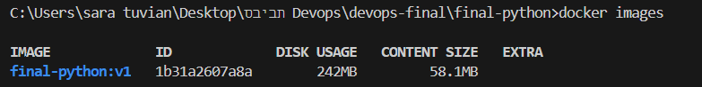

This screenshot shows the Docker image created successfully after build.

---

### Running Containers (docker ps)

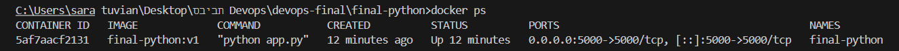

This screenshot shows the running container using `docker ps`.

---

### Docker Desktop View

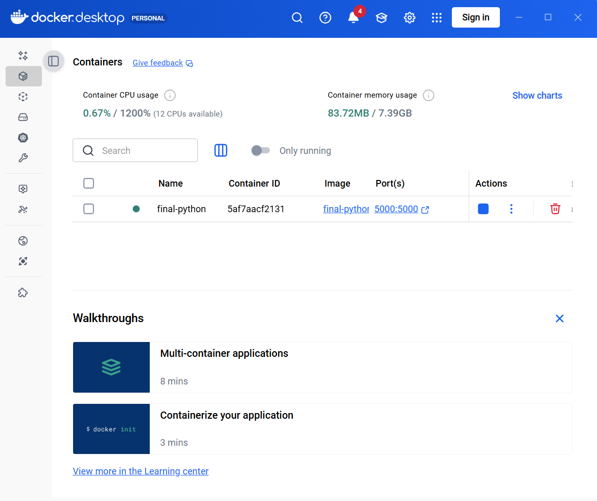

Docker Desktop confirms that the container is active and running.

---

# Part B – CI/CD with GitHub Actions (50 Points)

A GitHub Actions workflow was created to automate:

1. Checkout the repository
2. Build the Docker image
3. Push the image to DockerHub

## GitHub Repository

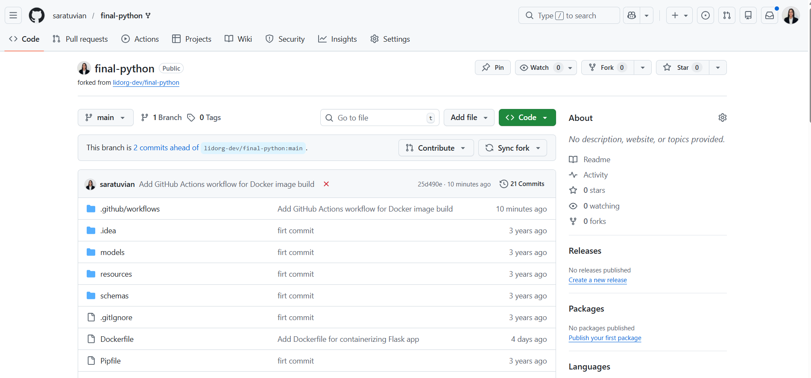

## Workflow YAML

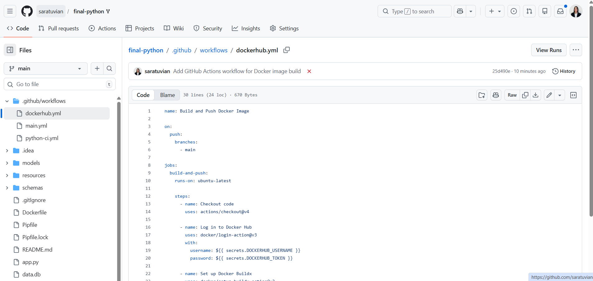

The workflow configuration defines Docker build and push steps.

## Workflow Running Successfully

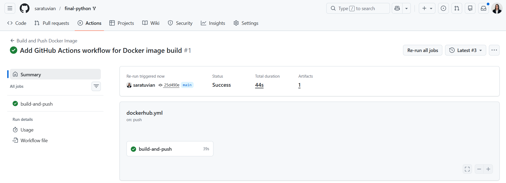

The workflow executed successfully without errors.

## DockerHub Repository

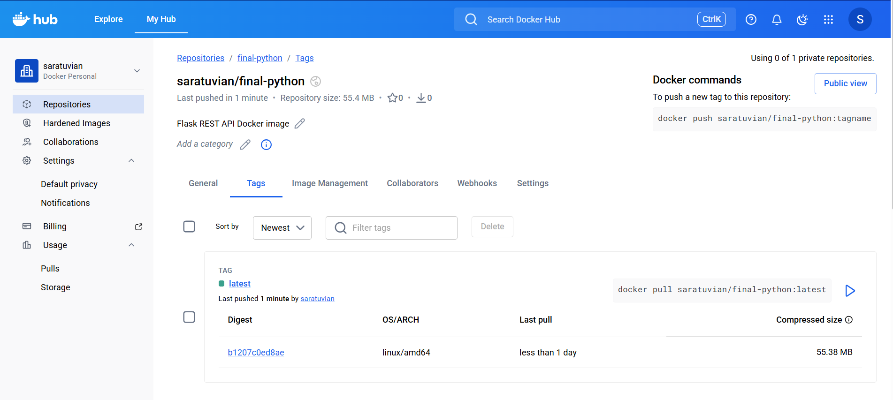

The image was pushed to DockerHub and tagged as `latest`.

---

# Part C – ECS Deployment on AWS (25 Points)

The Docker image from DockerHub was deployed to AWS ECS using Fargate.

## ECS Cluster

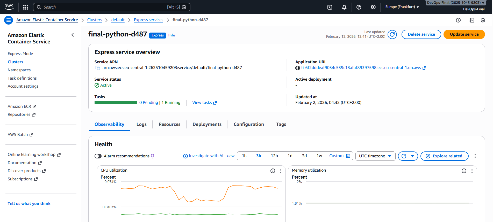

An ECS cluster was created in AWS (eu-central-1 region).

## Task Definition

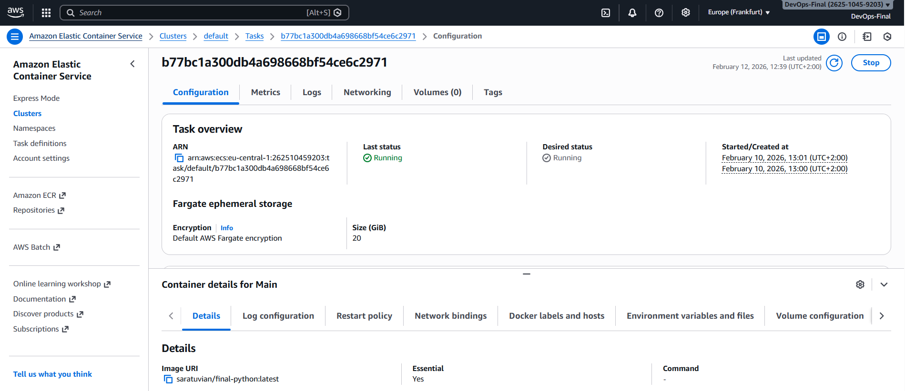

The task definition references the Docker image stored in DockerHub (saratuvian/final-python:latest) and exposes port 80 for public access through ECS Service.

## ECS Service

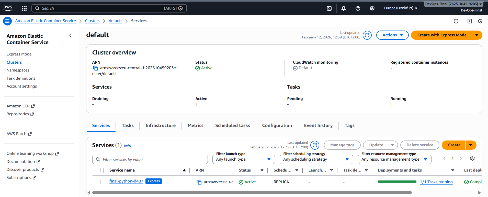

An ECS Service was created to run one task replica continuously.

## Application Running on AWS

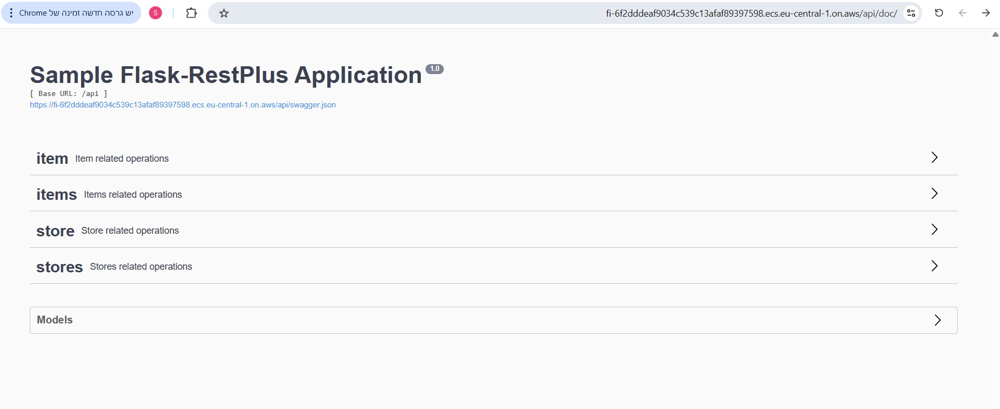

The deployed application is publicly accessible and returns "OK" in the browser.

---

# Summary

This project demonstrates:

- Docker containerization
- CI/CD pipeline using GitHub Actions
- Automated push to DockerHub
- Cloud deployment using AWS ECS (Fargate)

All required screenshots and explanations are provided according to the assignment instructions.
